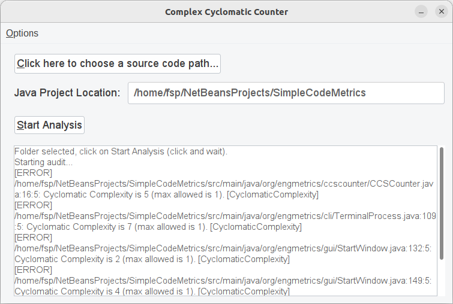

# Simple Code Metrics

Simple Code Metrics é um projeto para fornecer um programa simples para estudantes e pesquisadores de Engenharia de Software. A ideia principal é que seja possível, sem conhecimento prévio, aplicar este programa em projetos para obter métricas das estruturas de códigos. Atualmente analisa somente projetos desenvolvidos em Java.

[Click here to README in english](README-en.md)

## Motivação
O projeto [Checkstyle.org](https://checkstyle.sourceforge.io/) fornece uma completa ferramenta para avaliar se as estruturas de códigos em Java seguem um padrão de implementação (muito obrigado colaboradores!). É uma excelente ferramenta, porém demanda muitas configurações para que possamos utilizar a mesma seja por meio do seu executável .jar ou integradas nos ambientes de desenvolvimento (IDEs). A ideia aqui é utilizar a análise sintática de aferimento de regras para avaliar métricas do código sem configurações extras, por meio de uma interface simplificada. Apesar do objetivo de fornecer uma ferramenta de análise para quem está iniciando na área de programação, outros podem se beneficiar da mesma.  

Existe a intenção futura de que possa analisar projetos implementados em outras linguagens de programação.

## Funcionalidades
- Calcula a Complexidade Aciclomática de todas as classes do projeto.

## Como usar
Faça o download da última versão. Não é necessário nenhuma instalação, apenas que exista o java instalado na máquina. O diretório da aplicação possui o executável .jar e um diretório tools que possui arquivos de configurações necessárias para o funcionamento do software. Execute o arquivo .jar e siga as instruções em tela.

## Compatibilidade e Testes
- Java JDK 18 ou superior (existe um executável para Java 8);
- Sistemas Operacionais: Linux e Windows;

## Desenvolvimento
O projeto é desenvolvido em Java utilizando [Maven](https://maven.apache.org/what-is-maven.html) como gerenciador. Verifique pelas configurações e versões das dependências no pom.xml. Para os testes é utilizado JUnit5.

### Como Contribuir (desenvolvimento)
- Faça o fork do projeto. 
- Abra ou use alguma issue para trocar ideias (isto ajuda a deixar registrado o que estiver desenvolvendo).
- Crie uma branch com a descrição da funcionalidade/correção. Inclua o número da issue no nome da branch.
- Faça o pull request.

### Como Contribuir (outras formas)
- Informar bugs;
- Propor melhorias (inclua desenhos ou outras especificações com o máximo de detalhes).
